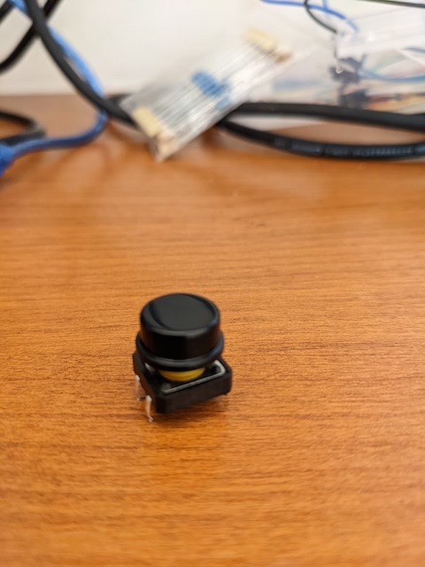

# clase-09-proyecto-mitad-semestre

## intsrucciones

* hacer login en GitHub.com
* entrar a este repositorio disponible en [https://github.com/aud5i022-2022-1/clase-09-proyecto-mitad-semestre](https://github.com/aud5i022-2022-1/clase-09-proyecto-mitad-semestre)
* hacer click en el botón "Fork" de este repositorio para copiarlo a tu cuenta personal.
* enviar el enlace de tu repositorio y la lista de integrantes a través de u-cursos al instructor.
* ahora puedes editar este archivo siguiendo este enlace [README.md](README.md) y haciendo click en el ícono de lápiz para editar.
* recomendación: grabar tus avances seguido, para que no pierdas tu avance, para esto, baja al final de la sección de edición, elige la opción " Commit directly to the main branch." luego haz click en el botón verde "Commit changes". repite esto cada vez que quieras grabar cambios.
* para subir imágenes, haz click en este enlace a la carpeta [imagenes/](imagenes/), luego haz click en el botón "Add files" y selecciona "Upload files". arrastra tus imágenes o añadelas con el enlace "choose your files". luego elige la opción "Commit directly to the main branch" y haz click en el botón verde "Commit changes"

## contenidos de este repositorio

* carpeta [codigo_arduino/](codigo_arduino/): carpeta para tener el codigo de tu proyecto
  * archivo [odigo_arduino/codigo_arduino.ino](codigo_arduino/codigo_arduino.ino) : debe incluir encabezado y comentarios describiendo tu proyecto
* carpeta [imagenes/](imagenes/): sube aquí las imágenes para tu proyecto.
  * archivo [/imagenes/00-ejemplo.jpg](/imagenes/00-ejemplo.jpg) como ejemplo.
* archivo [README.md](README.md)]: este mismo archivo, aquí escribe tus apuntes durante el proyecto.
* archivo [README.pdf](README.pdf): este archivo pero convertido a PDF, puedes borrarlo.

## ejemplos útiles

cada párrafo es una línea continua de texto. los puntos "." son para punto seguido.
esta línea está escrita en la siguiente línea en el archivo, pero se ve seguida a la anterior.

para hacer un nuevo párrafo, hay que dejar una línea en blanco entremedio.

* las
* listas
* son
* así
  * las sub-listas
  * son así
  * con dos espacios de indentación

los enlaces se hacen con corchetes y después paréntesis. el texto dentro de corchetes es lo que se ve en el enlace, y el texto dentro de paréntesis es dónde va ese enlace. les pido que sea el mismo texto. aquí ejemplos de enlaces a web y a otros archivos dentro de este repositorio.

* [https://www.wikipedia.org/](https://www.wikipedia.org/)
* [https://www.arduino.cc/](https://www.arduino.cc/)
* [imagenes/00-ejemplo.jpg](imagenes/00-ejemplo.jpg)
* [codigo_arduino/codigo_arduino.ino](codigo_arduino/codigo_arduino.ino)

para incluir imágenes que sean visibles en este documento, es igual que un enlace a una imagen, pero con un signo de exclamación antes de los corchetes "!", así:

## Borrador de muestra

A continuación les dejo un breve borrador con ejemplos, que si completan, tendrán todos los puntos de la pauta, suerte!

## Acerca de

Este proyecto de mitad de semestre fue hecho en el día martes 10 de mayo 2022, como parte del curso  aud5i022-2022-1.

los integrantes son Valentina Chapana, Gabriel López, Benjamín Órdenes.

## Lista de materiales

Los materiales son:

* Arduino Uno
* Protoboard
* Cables
* Potenciómetro
* Tres botones
* Resistencia
* Parlante

## Armado de circuito

Estos son los pasos para armar el circuito.

primero hacemos X y se ve así.

después hacemos Y y se ve así.

## código para microcontrolador Arduino

el código está hecho para Arduino Uno, y está incluido en este repositorio aquí: [codigo_arduino/codigo_arduino.ino](codigo_arduino/codigo_arduino.ino).

este código está basado en los ejemplos de Arduino que se hicieron en la [clase 7](https://github.com/montoyamoraga/aud5i022-2022-1/tree/main/clases/clase-07), más especificamente en el [ejemplo 1](https://github.com/montoyamoraga/aud5i022-2022-1/tree/main/clases/clase-07/ej_01_melodia) y el [ejemplo 2](https://github.com/montoyamoraga/aud5i022-2022-1/tree/main/clases/clase-07/ej_02_sonido_pulsador). Tambien un ejemplo de la [clase 5](https://github.com/montoyamoraga/aud5i022-2022-1/tree/main/clases/clase-05), el [ejemplo 0](https://github.com/montoyamoraga/aud5i022-2022-1/blob/main/clases/clase-05/ej_00_lectura_pulsador/ej_00_lectura_pulsador.ino).

Primero que todo declaramos el archivo adjunto [notas.h](https://github.com/montoyamoraga/aud5i022-2022-1/blob/main/clases/clase-07/ej_01_melodia/notas.h) que define la frecuencia de cada nota. Despues de definir eso, declaramos cada melodia con su duración, el multiplicador de duración de las notas en general, el multiplicador de pausa que utiliza el comando "float". Despues se declaro el pin del parlante que es el pin digital 11 y los 3 botones que son el pin 7, 6, 5 respectivamente y por último se declara el estado de cada botón.

En setup solo usamos "Serial.begin(9600)" y en el loop usamos "digitalRead" en cada botón

## conclusiones

en este proyecto tuvimos los siguientes aprendizajes: 

* botón pulsador
* circuito para 

lo más difícil de este proyecto fue bla.

cometimos los siguientes errores durante el armado del circuito y en el código, y los solucionamos así y este error no lo supimos resolver.

este proyecto lo vemos como la base para lograr bla, nos hace pensar en bla, y nos gustaría expandirlo para 10 botones y mil luces y diez arduinos conectados por wifi.
